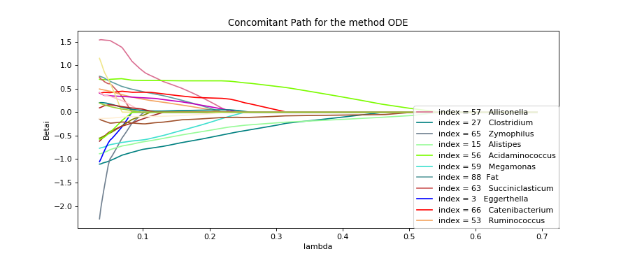
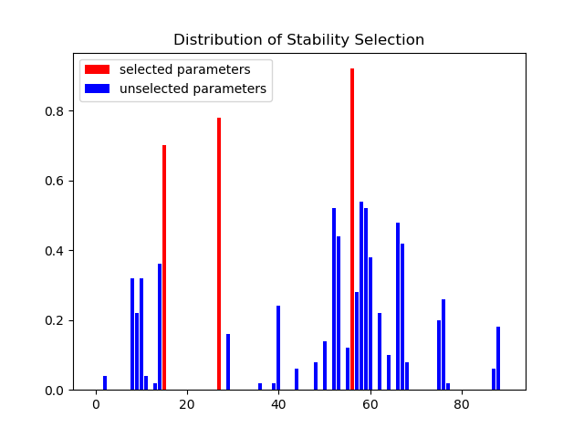
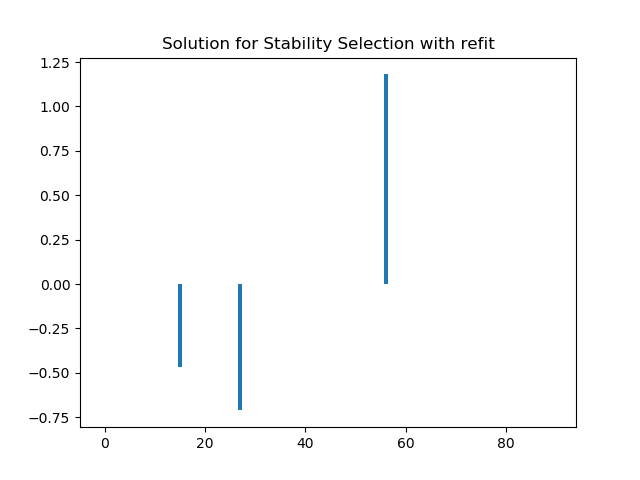
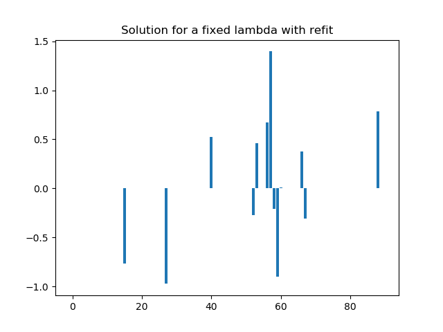

# C-lasso, a Python package for sparse regression with linear equality constraints

## Table of Contents

* [How to use the package](#how-to-use-the-package)
* [Different type of problem](#different-type-of-problem)
* [Different methods for solving the problems](#different-methods-for-solving-the-problems)
* [Two main functions](#two-main-functions)
* [Little functions](#little-functions)
* [Example](#example)


##  How to use the package

#### To install the package : 
```shell
pip install c_lasso
```

#### To import the package :
```python
from classo import *
```
#### To import the required packages  :
```shell
pip install numpy
pip install matplotlib
pip install scipy
pip install pandas
pip install time
```
    

##  Different type of problem
#### Least square :             


#### Huber  :                   


#### Concomitant Least square : 


#### Concomitant Huber :        


## Different methods for solving the problems

### Four main methods have been implemented for those.


#### Forward Backward splitting method:
Standard way to solve a convex minimisation problem with an addition of
smooth and non-smooth function : Projected Proximal Gradient Descent. This
method only works with the two non concomitants problems. For the huber
problem, we use the second formulation.

#### No-proj method
Similar to the Projected Proximal Gradient Descent, but which does not involve
a projection, which can be difficult to compute for some matrix C. Only for
non concomitant problems.

#### Double prox method
Use of Doulgas Rachford splitting algorithm which use the proximal operator of
both functions. It also solves concomitant problems, but it is usefull even in the
non concomitant case because it is usually more efficient than forward backward
splitting method. For the huber problem, we use the second formulation, then
we change it into a Least square problem of dimension m (m + d) instead of m d.

#### ODE method  
From the KKT conditions, we can derive an simple ODE for the solution of
the non concomitants problems, which shows that the solution is piecewise-
affine. For the least square, as the problem can always be reported to a a non
concomitant problem for another lambda, one can use the whole non-concomitant-
path computed with the ODE method to then solve the concomitant-path.


## Example on random data

Here is an example of use of one of the methods  : concomitant algorithm with theoretical lambda, tested on data generated randomly. 

To generate the data :
```python
m,d,d_nonzero,k,sigma =100,100,5,1,0.5
(X,C,y),sol = random_data(m,d,d_nonzero,k,sigma,zerosum=True)
```
Use of the package with default settings (example1) :
```python
problem = classo_problem(X,y,C) 
problem.solve()
print(problem)
print(problem.solution)
```

Results : 

```
FORMULATION : Concomitant
 
MODEL SELECTION COMPUTED :  Stability selection, 
 
STABILITY SELECTION PARAMETERS: method = first;  lamin = 0.01;  B = 50;  q = 10;  pourcent_nS = 0.5;  threshold = 0.9;  numerical_method = ODE

SPEEDNESS : 
Running time for Cross Validation    : 'not computed'
Running time for Stability Selection : 2.15s
Running time for Fixed LAM           : 'not computed'
```


Example of different settings (example2) : 
```python
problem                                     = classo_problem(X,y,C)
problem.formulation.huber                   = True
problem.formulation.concomitant             = False
problem.model_selection.CV                  = True
problem.model_selection.LAMfixed            = True
problem.model_selection.SSparameters.method = 'max'
problem.solve()
print(problem)
print(problem.solution)

problem.solution.CV.graphic(mse_max = 1.)
```

Results : 
```
FORMULATION : Huber
 
MODEL SELECTION COMPUTED :  Cross Validation,  Stability selection, Lambda fixed
 
CROSS VALIDATION PARAMETERS: Nsubset = 5  lamin = 0.001  n_lam = 500;  numerical_method = ODE
 
STABILITY SELECTION PARAMETERS: method = max;  lamin = 0.01;  B = 50;  q = 10;  pourcent_nS = 0.5;  threshold = 0.9;  numerical_method = ODE
 
LAMBDA FIXED PARAMETERS: lam = theoritical;  theoritical_lam = 0.3988;  numerical_method = ODE

SPEEDNESS : 
Running time for Cross Validation    : 1.013s
Running time for Stability Selection : 2.281s
Running time for Fixed LAM           : 0.065s
```


## Example on microbiome data

Here is now the code of the file "example_COMBO" which uses microbiome data : 

```python
from CLasso import *
import numpy as np


CaloriData           = csv_to_mat('data/CaloriData.csv',begin=0).astype(float)
FatData              = csv_to_mat('data/FatData.csv',begin=0).astype(float)
BMI                  = csv_to_mat('data/BMI.csv',begin=0).astype(float)[:,0]
GeneraFilteredCounts = csv_to_mat('data/GeneraFilteredCounts.csv',begin=0).astype(float)
GeneraCounts         = csv_to_mat('data/GeneraCounts.csv',begin=0).astype(float).T
CFiltered            = sio.loadmat('data/CFiltered.mat')
# load phylogenetic tree
GeneraPhylo          = csv_to_mat('data/GeneraPhylo.csv').astype(str)[:,-1]

labels = np.concatenate([GeneraPhylo,np.array(['Calorie','Fat','Biais'])])
#BMI data (n=96)
y = BMI - np.mean(BMI)
#Covariate data
X_C = CaloriData - np.mean(CaloriData, axis=0)
X_F = FatData - np.mean(FatData, axis=0)

# Countdata of 87 genera
# CLR transform data with pseudo count of 0.5 ;
X0 = clr(GeneraCounts, 1 / 2)
# Joint microbiome and covariate data and offset
X = np.concatenate((X0, X_C, X_F, np.ones((n, 1))), axis=1)
C = np.ones((1,len(X[0])))
C[0,-1],C[0,-2],C[0,-3] = 0.,0.,0.


problem = classo_problem(X,y,C, labels=labels)
problem.formulation.concomitant = True

# Solve the problem for a fixed lambda (by default, it will use the theoretical lambda)
problem.model_selection.LAMfixed = True
problem.model_selection.LAMfixedparameters.true_lam = True


# Solve the stability selection : (by default, it will use the theoretical lambda)
problem.model_selection.SS                       = True
problem.model_selection.SSparameters.method      = 'lam'
problem.model_selection.SSparameters.true_lam    =  True
problem.model_selection.SSparameters.threshold   = 0.6


# Solve the entire path
problem.model_selection.PATH = True
problem.model_selection.PATHparameters.plot_sigma = True


problem.solve()

print(problem)
print(problem.solution)


```

Results : 
```
FORMULATION : Concomitant
 
MODEL SELECTION COMPUTED :  Path,  Stability selection, Lambda fixed
 
STABILITY SELECTION PARAMETERS: method = lam;  lamin = 0.01;  B = 50;  q = 10;  pourcent_nS = 0.5;  threshold = 0.6;  numerical_method = ODE
 
LAMBDA FIXED PARAMETERS: lam = theoritical;  theoritical_lam = 0.1997;  numerical_method = ODE
 
PATH PARAMETERS: Npath = 500  n_active = False  lamin = 0.05  n_lam = 500;  numerical_method = ODE

SELECTED PARAMETERS : 
15  Alistipes
27  Clostridium
56  Acidaminococcus
SPEEDNESS : 
Running time for Path computation    : 2.699s
Running time for Cross Validation    : 'not computed'
Running time for Stability Selection : 0.351s
Running time for Fixed LAM           : 0.009s

```









