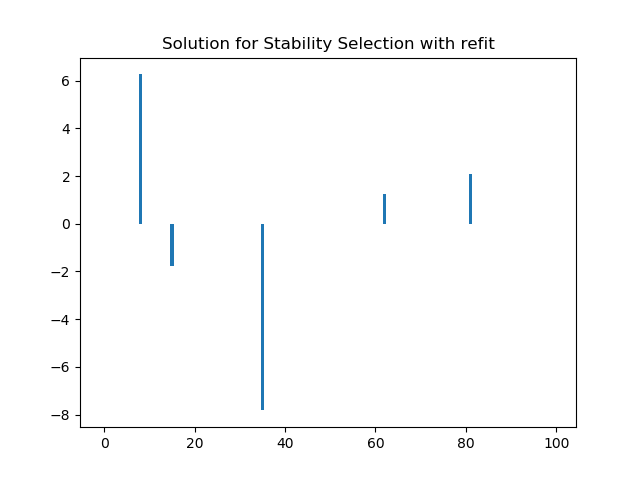
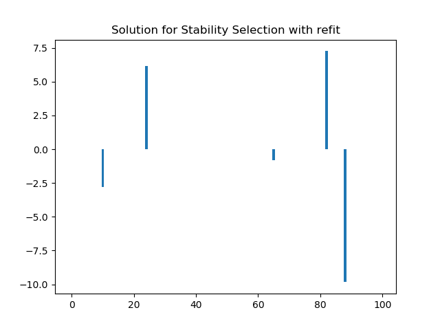
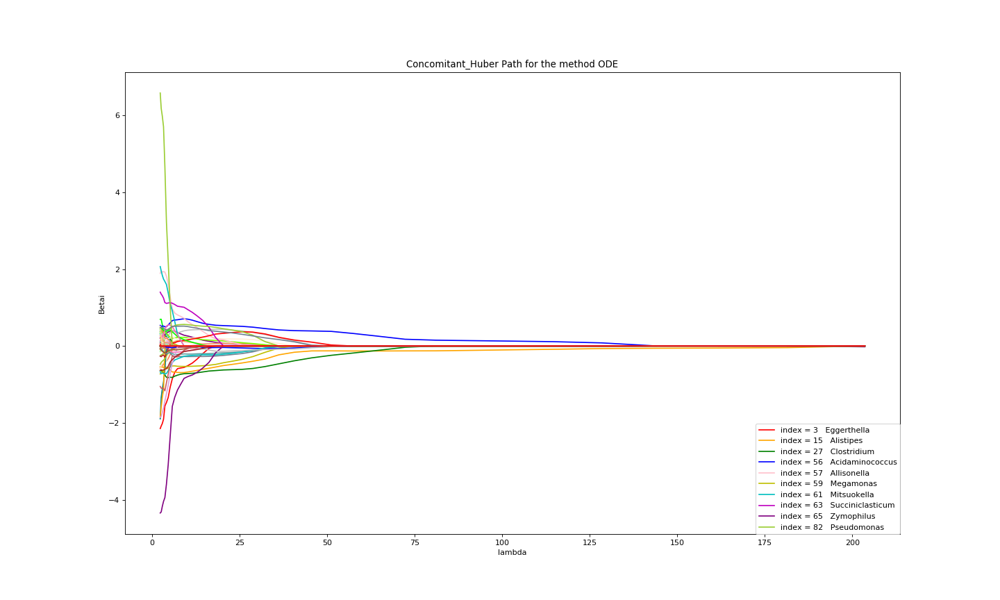
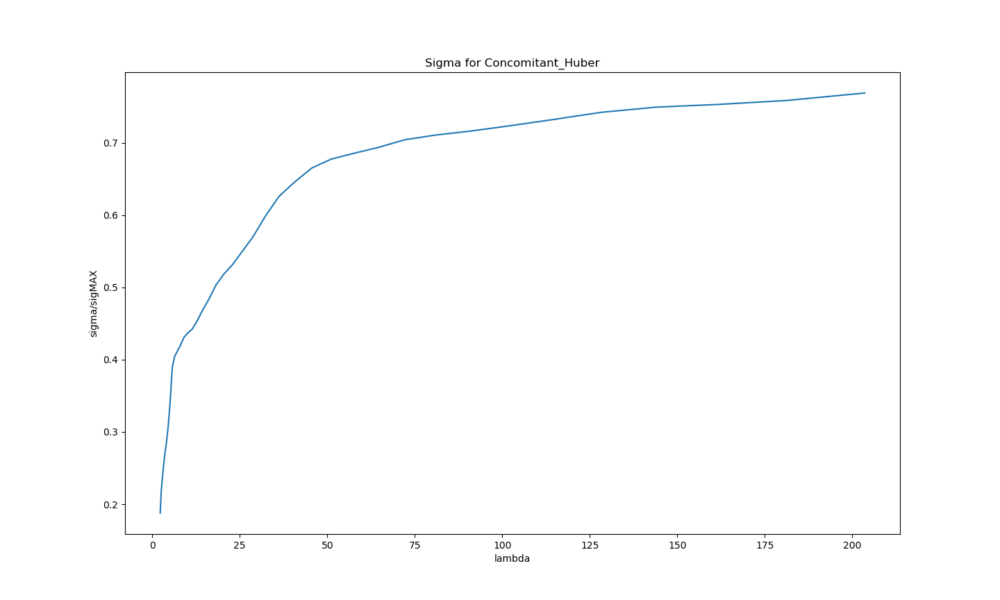
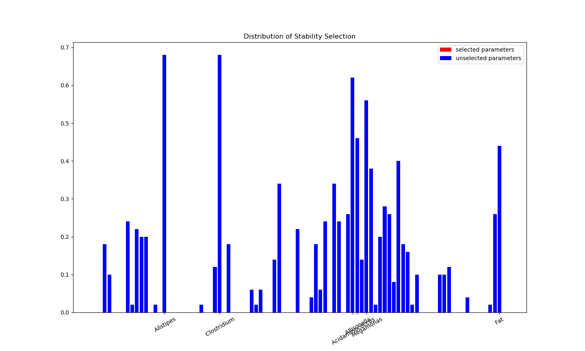
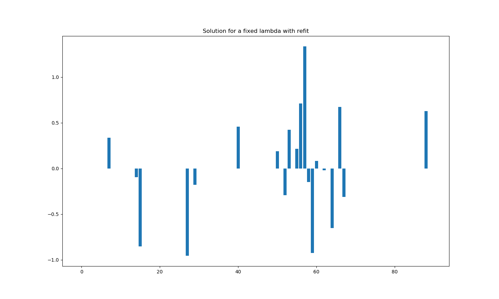
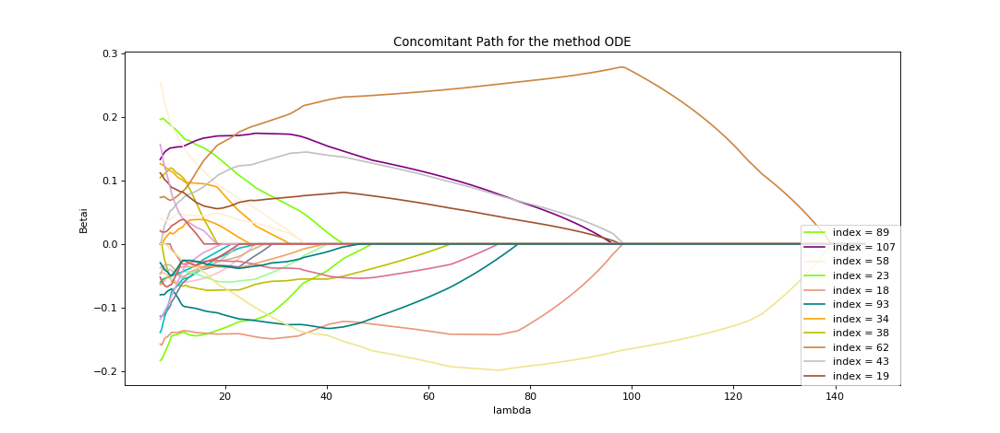
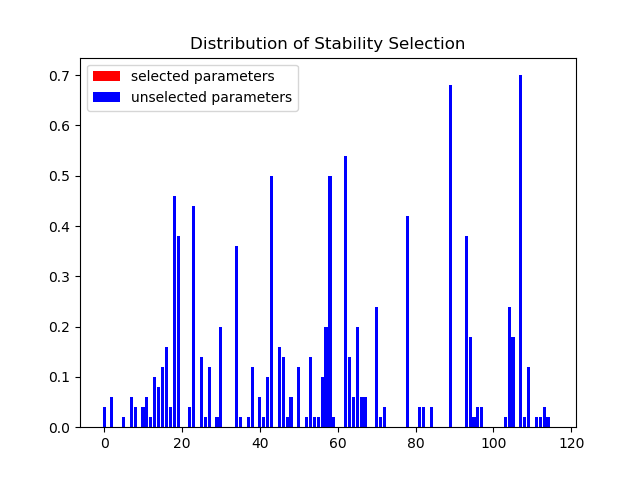
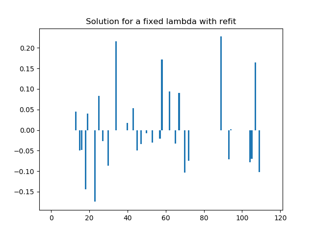

# c-lasso, a Python package for sparse linear regression with linear equality constraints

## Table of Contents

* [How to use the package](#how-to-use-the-package)
* [Different type of problem](#different-type-of-problem)
* [Different methods for solving the problems](#different-methods-for-solving-the-problems)
* [Two main functions](#two-main-functions)
* [Little functions](#little-functions)
* [Example](#example)

# c-lasso: a Python package for constrained sparse regression and classification 


c-lasso is a Python package that enables sparse and robust linear regression and classification with linear equality
constraints on the model parameters. The forward model is assumed to be: 

 

Here, y and X are given outcome and predictor data. The vector y can be continuous (for regression) or binary (for classification). C is a general constraint matrix. The vector &beta; comprises the unknown coefficients and &sigma; an 
unknown scale.

The package handles several different estimators for inferring &beta; (and &sigma;), including 
the constrained Lasso, the constrained scaled Lasso, and sparse Huber M-estimation with linear equality constraints.
Several different algorithmic strategies, including path and proximal splitting algorithms, are implemented to solve 
the underlying convex optimization problems.

We also include two model selection strategies for determining the sparsity of the model parameters: k-fold cross-validation and stability selection.   

This package is intended to fill the gap between popular python tools such as [scikit-learn](https://scikit-learn.org/stable/) which CANNOT solve sparse constrained problems and general-purpose optimization solvers that do not scale well for the considered problems.

Below we show several use cases of the package, including an application of sparse log-contrast
regression tasks for compositional microbiome data.

The code builds on results from several papers which can be found in the [References](#references).

## Table of Contents

* [Installation](#installation)
* [Regression and classification problems](#regression-and-classification-problems)
* [Getting started](#getting-started)
* [Log-contrast regression for microbiome data](#log-contrast-regression-for-microbiome-data)
* [Two main functions](#two-main-functions)
* [Misc functions](#little-functions)
* [Optimization schemes](#optimization-schemes)
* [References](#references)


##  How to use the package

#### To install the package : 
```shell
pip install c_lasso
```

#### To import the package :
```python
from classo import *
```
#### To import the required packages  :
```shell
pip install numpy
pip install matplotlib
pip install scipy
pip install pandas
pip install time
```
    

##  Different type of problem
#### Least square :             


#### Huber  :                   


#### Concomitant Least square : 

0}&space;\frac{||&space;X\beta-y&space;||^2}{\sigma}&plus;&space;n\sigma&space;&plus;&space;\lambda&space;||\beta||_1&space;\qquad&space;C\beta=0"  />

#### Concomitant Huber :        

0}&space;h_{\rho}(\frac{X\beta-y}{\sigma}&space;)&space;&plus;&space;n\sigma&space;&plus;&space;\lambda&space;||\beta||_1&space;\qquad&space;C\beta=0" />


--------

This formulation combines [R2] and [R3] to allow robust joint estimation of the (constrained) &beta; vector and 
the scale &sigma; in a concomitant fashion (see [References](#references) [4,5] for further info).


## Different methods for solving the problems

### Four main methods have been implemented for those.


#### Forward Backward splitting method:
Standard way to solve a convex minimisation problem with an addition of
smooth and non-smooth function : Projected Proximal Gradient Descent. This
method only works with the two non concomitants problems. For the huber
problem, we use the second formulation.

#### No-proj method
Similar to the Projected Proximal Gradient Descent, but which does not involve
a projection, which can be difficult to compute for some matrix C. Only for
non concomitant problems.

#### Double prox method
Use of Doulgas Rachford splitting algorithm which use the proximal operator of
both functions. It also solves concomitant problems, but it is usefull even in the
non concomitant case because it is usually more efficient than forward backward
splitting method. For the huber problem, we use the second formulation, then
we change it into a Least square problem of dimension m (m + d) instead of m d.

#### ODE method  
From the KKT conditions, we can derive an simple ODE for the solution of
the non concomitants problems, which shows that the solution is piecewise-
affine. For the least square, as the problem can always be reported to a a non
concomitant problem for another lambda, one can use the whole non-concomitant-
path computed with the ODE method to then solve the concomitant-path.


## Example on random data
=======
#### Basic example             


Here is an example of use of one of the methods  : concomitant algorithm with theoretical lambda, tested on data generated randomly. 

To generate the data :
```python
m,d,d_nonzero,k,sigma =100,100,5,1,0.5
(X,C,y),sol = random_data(m,d,d_nonzero,k,sigma,zerosum=True)
```
Use of the package with default settings (example1) :
```python
problem = classo_problem(X,y,C) 
problem.solve()
print(problem)
print(problem.solution)
```

Results : 

```
FORMULATION : Concomitant
 
MODEL SELECTION COMPUTED :  Stability selection, 
 
STABILITY SELECTION PARAMETERS: method = first;  lamin = 0.01;  B = 50;  q = 10;  pourcent_nS = 0.5;  threshold = 0.9;  numerical_method = ODE
```
As we have not specified any problem, algorithm, or model selection settings, this problem instance
represents the *default* settings for a c-lasso instance: 
- The problem is of regression type and uses formulation [R3], i.e. with concomitant scale estimation. 
- The *default* optimization scheme is the path algorithm (see [Optimization schemes](#optimization-schemes) for further info). 
- For model selection, stability selection at a theoretically derived &lambda; value is used (see [Reference](#references) [4] for details). Stability selection comprises a relatively large number of parameters. For a description of the settings, we refer to the more advanced examples below and the API.

You can solve the corresponding c-lasso problem instance using

```python
problem.solve()
```

``
SPEEDNESS : 
Running time for Cross Validation    : 'not computed'
Running time for Stability Selection : 2.15s
Running time for Fixed LAM           : 'not computed'
```





<<<<<<< HEAD
Example of different settings (example2) : 
=======
#### Advanced example             

In the next example, we show how one can specify different aspects of the problem 
formulation and model selection strategy.


```python
problem                                     = classo_problem(X,y,C)
problem.formulation.huber                   = True
problem.formulation.concomitant             = False
problem.model_selection.CV                  = True
problem.model_selection.LAMfixed            = True
problem.model_selection.SSparameters.method = 'max'
problem.solve()
print(problem)
print(problem.solution)

problem.solution.CV.graphic(mse_max = 1.)
```

Results : 
```
FORMULATION : Huber
 
MODEL SELECTION COMPUTED :  Cross Validation,  Stability selection, Lambda fixed
 
CROSS VALIDATION PARAMETERS: Nsubset = 5  lamin = 0.001  n_lam = 500;  numerical_method = ODE
 
STABILITY SELECTION PARAMETERS: method = max;  lamin = 0.01;  B = 50;  q = 10;  pourcent_nS = 0.5;  threshold = 0.9;  numerical_method = ODE
 
LAMBDA FIXED PARAMETERS: lam = theoritical;  theoritical_lam = 0.3988;  numerical_method = ODE

SPEEDNESS : 
Running time for Cross Validation    : 1.013s
Running time for Stability Selection : 2.281s
Running time for Fixed LAM           : 0.065s
```





## Log-contrast regression for microbiome data

Here is now the result of running the file "example_COMBO" which uses microbiome data :  
```
FORMULATION : Concomitant
 
MODEL SELECTION COMPUTED :  Path,  Stability selection, Lambda fixed
 
STABILITY SELECTION PARAMETERS: method = lam;  lamin = 0.01;  lam = theoritical;  B = 50;  q = 10;  percent_nS = 0.5;  threshold = 0.7;  numerical_method = ODE
 
LAMBDA FIXED PARAMETERS: lam = theoritical;  theoritical_lam = 19.1709;  numerical_method = ODE
 
PATH PARAMETERS: Npath = 40  n_active = False  lamin = 0.011220184543019636;  numerical_method = ODE
 objc[46200]: Class FIFinderSyncExtensionHost is implemented in both /System/Library/PrivateFrameworks/FinderKit.framework/Versions/A/FinderKit (0x7fff96e66b68) and /System/Library/PrivateFrameworks/FileProvider.framework/OverrideBundles/FinderSyncCollaborationFileProviderOverride.bundle/Contents/MacOS/FinderSyncCollaborationFileProviderOverride (0x116315cd8). One of the two will be used. Which one is undefined.
SELECTED PARAMETERS : 
27  Clostridium
SIGMA FOR LAMFIXED  :  8.43571426081596
SPEEDNESS : 
Running time for Path computation    : 0.057s
Running time for Cross Validation    : 'not computed'
Running time for Stability Selection : 1.002s
Running time for Fixed LAM           : 0.028s
 
 
FORMULATION : Concomitant_Huber
 
MODEL SELECTION COMPUTED :  Path,  Stability selection, Lambda fixed
 
STABILITY SELECTION PARAMETERS: method = lam;  lamin = 0.01;  lam = theoritical;  B = 50;  q = 10;  percent_nS = 0.5;  threshold = 0.7;  numerical_method = ODE
 
LAMBDA FIXED PARAMETERS: lam = theoritical;  theoritical_lam = 19.1709;  numerical_method = ODE
 
PATH PARAMETERS: Npath = 40  n_active = False  lamin = 0.011220184543019636;  numerical_method = ODE
 SELECTED PARAMETERS : 
SIGMA FOR LAMFIXED  :  6.000336772926475
SPEEDNESS : 
Running time for Path computation    : 18.517s
Running time for Cross Validation    : 'not computed'
Running time for Stability Selection : 3.166s
Running time for Fixed LAM           : 0.065s


```











Here is now the result of running the file "example_PH" which uses microbiome data : 
```
FORMULATION : Concomitant
 
MODEL SELECTION COMPUTED :  Path,  Stability selection, Lambda fixed
 
STABILITY SELECTION PARAMETERS: method = lam;  lamin = 0.01;  lam = theoritical;  B = 50;  q = 10;  percent_nS = 0.5;  threshold = 0.7;  numerical_method = ODE
 
LAMBDA FIXED PARAMETERS: lam = theoritical;  theoritical_lam = 19.1991;  numerical_method = ODE
 
PATH PARAMETERS: Npath = 500  n_active = False  lamin = 0.05  n_lam = 500;  numerical_method = ODE


SIGMA FOR LAMFIXED  :  0.7473015322224758
SPEEDNESS : 
Running time for Path computation    : 0.08s
Running time for Cross Validation    : 'not computed'
Running time for Stability Selection : 1.374s
Running time for Fixed LAM           : 0.024s
```









## Optimization schemes

The available problem formulations [R1-C2] require different algorithmic strategies for 
efficiently solving the underlying optimization problem. We have implemented four 
algorithms (with provable convergence guarantees) that vary in generality and are not 
necessarily applicable to all problems. For each problem type, c-lasso has a default algorithm 
setting that proved to be the fastest in our numerical experiments.

### Path algorithms (Path-Alg) 
This is the default algorithm for non-concomitant problems [R1,R3,C1,C2]. 
The algorithm uses the fact that the solution path along &lambda; is piecewise-
affine (as shown, e.g., in [1]). When Least-Squares is used as objective function,
we derive a novel efficient procedure that allows to also derive the 
solution for the concomitant problem [R2] along the path with little extra cost.

### Projected primal-dual splitting method (P-PDS):
Standard way to solve a convex minimisation problem with an addition of
smooth and non-smooth function: Projected Proximal Gradient Descent. This
method only works with the two non concomitants problems. For the huber
problem, we use the second formulation.

### Projection-free primal-dual splitting method (PF-PDS):
Similar to the Projected Proximal Gradient Descent, but which does not involve
a projection, which can be difficult to compute for some matrix C. Only for
non concomitant problems.

### Douglas-Rachford-type splitting method (DR)
This algorithm is the most general algorithm and can solve all regression problems 
[R1-R4]. It is based on Doulgas Rachford splitting in a higher-dimensional product space.
It makes use of the proximity operators of the perspective of the LS objective (see [4,5])
The Huber problem with concomitant scale [R4] is reformulated as scaled Lasso problem 
with the mean shift (see [6]) and thus solved in (n + d) dimensions. 
 


## References 

* [1] B. R. Gaines, J. Kim, and H. Zhou, [Algorithms for Fitting the Constrained Lasso](https://www.tandfonline.com/doi/abs/10.1080/10618600.2018.1473777?journalCode=ucgs20), J. Comput. Graph. Stat., vol. 27, no. 4, pp. 861–871, 2018.

* [2] L. Briceno-Arias, S.L. Rivera, [A Projected Primal–Dual Method for Solving Constrained Monotone Inclusions](https://link.springer.com/article/10.1007/s10957-018-1430-2?shared-article-renderer), J. Optim. Theory Appl., vol 180, Issue 3 March 2019

* [3] 

* [4] P. L. Combettes and C. L. Müller, [Perspective M-estimation via proximal decomposition](https://arxiv.org/abs/1805.06098), Electronic Journal of Statistics, 2020, [Journal version](https://projecteuclid.org/euclid.ejs/1578452535) 

* [5] P. L. Combettes and C. L. Müller, [Regression models for compositional data: General log-contrast formulations, proximal optimization, and microbiome data applications](https://arxiv.org/abs/1903.01050), arXiv, 2019.

* [6] A. Mishra and C. L. Müller, [Robust regression with compositional covariates](https://arxiv.org/abs/1909.04990), arXiv, 2019.


