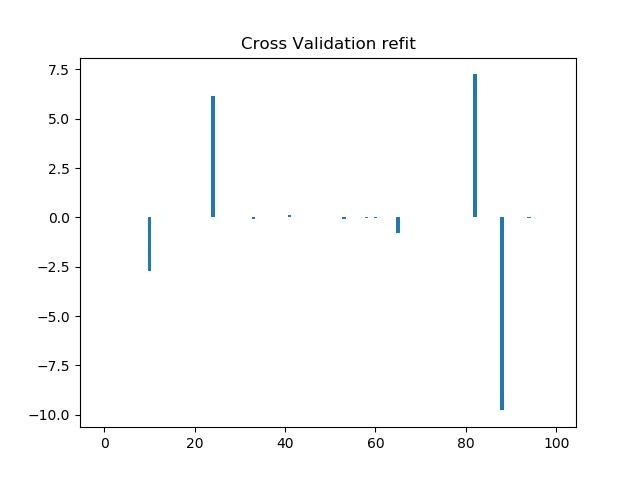
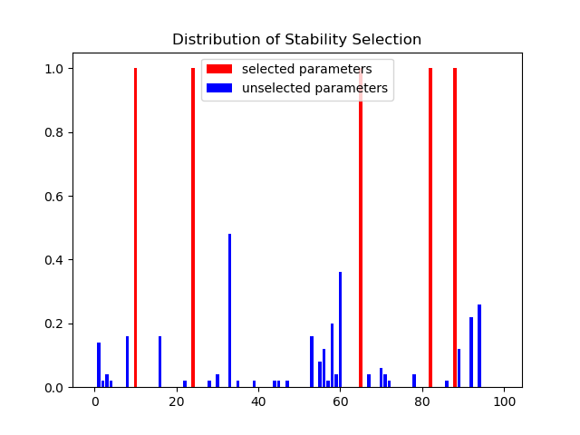
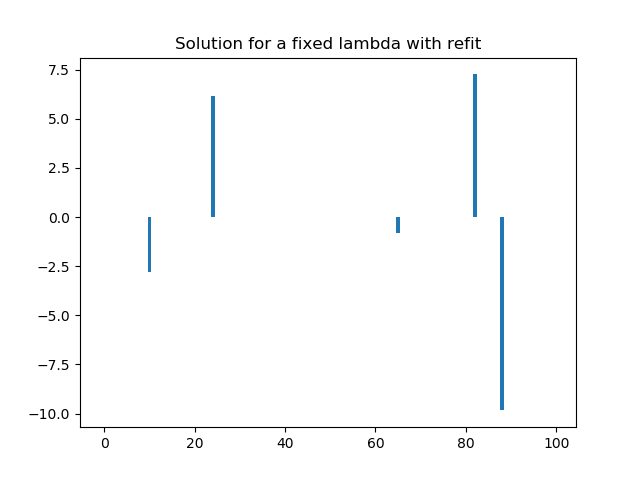
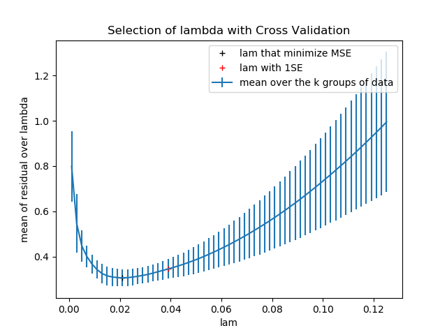
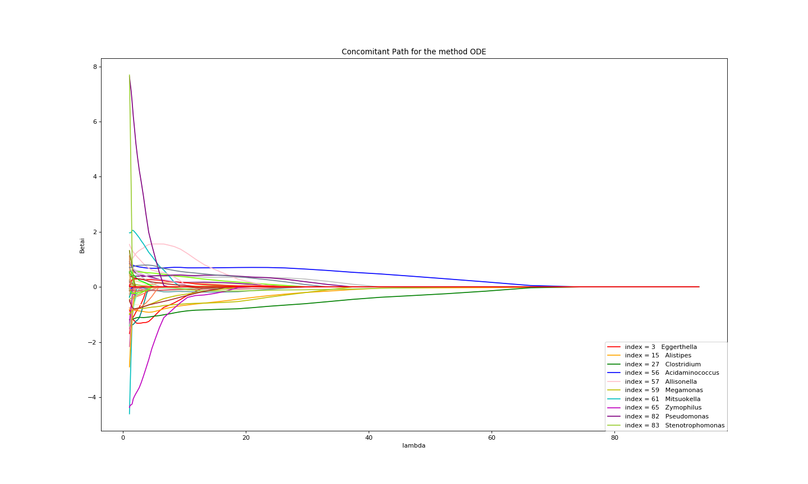
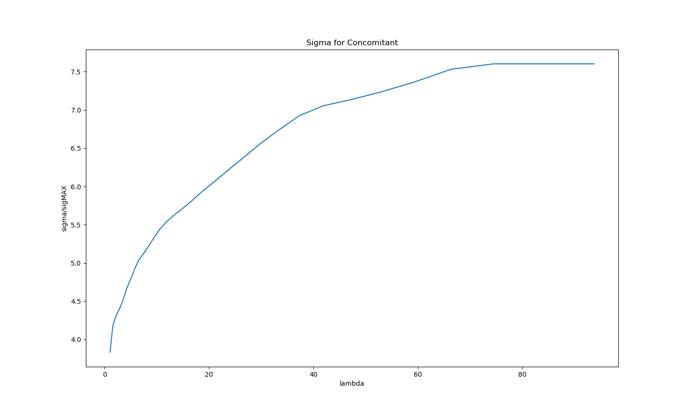
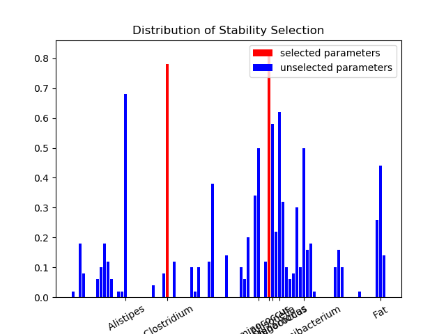
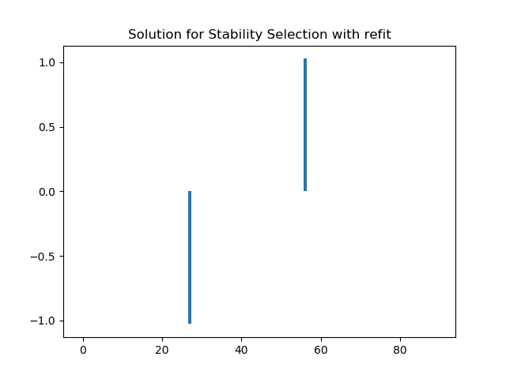
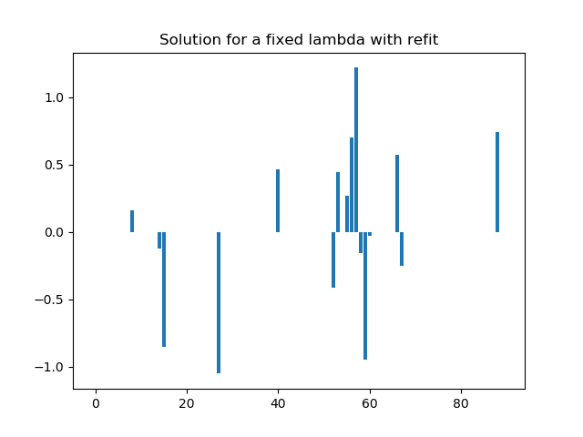
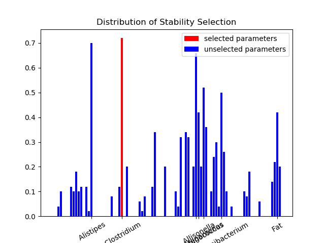

# c-lasso, a Python package for sparse linear regression with linear equality constraints

## Table of Contents

* [How to use the package](#how-to-use-the-package)
* [Different type of problem](#different-type-of-problem)
* [Different methods for solving the problems](#different-methods-for-solving-the-problems)
* [Two main functions](#two-main-functions)
* [Little functions](#little-functions)
* [Example](#example)


##  How to use the package

#### To install the package : 
```shell
pip install c_lasso
```

#### To import the package :
```python
from classo import *
```
#### To import the required packages  :
```shell
pip install numpy
pip install matplotlib
pip install scipy
pip install pandas
pip install time
```
    

##  Different type of problem
#### Least square :             


#### Huber  :                   


#### Concomitant Least square : 


#### Concomitant Huber :        


## Different methods for solving the problems

### Four main methods have been implemented for those.


#### Forward Backward splitting method:
Standard way to solve a convex minimisation problem with an addition of
smooth and non-smooth function : Projected Proximal Gradient Descent. This
method only works with the two non concomitants problems. For the huber
problem, we use the second formulation.

#### No-proj method
Similar to the Projected Proximal Gradient Descent, but which does not involve
a projection, which can be difficult to compute for some matrix C. Only for
non concomitant problems.

#### Double prox method
Use of Doulgas Rachford splitting algorithm which use the proximal operator of
both functions. It also solves concomitant problems, but it is usefull even in the
non concomitant case because it is usually more efficient than forward backward
splitting method. For the huber problem, we use the second formulation, then
we change it into a Least square problem of dimension m (m + d) instead of m d.

#### ODE method  
From the KKT conditions, we can derive an simple ODE for the solution of
the non concomitants problems, which shows that the solution is piecewise-
affine. For the least square, as the problem can always be reported to a a non
concomitant problem for another lambda, one can use the whole non-concomitant-
path computed with the ODE method to then solve the concomitant-path.


## Example on random data

Here is an example of use of one of the methods  : concomitant algorithm with theoretical lambda, tested on data generated randomly. 

To generate the data :
```python
m,d,d_nonzero,k,sigma =100,100,5,1,0.5
(X,C,y),sol = random_data(m,d,d_nonzero,k,sigma,zerosum=True)
```
Use of the package with default settings (example1) :
```python
problem = classo_problem(X,y,C) 
problem.solve()
print(problem)
print(problem.solution)
```

Results : 

```
FORMULATION : Concomitant
 
MODEL SELECTION COMPUTED :  Stability selection, 
 
STABILITY SELECTION PARAMETERS: method = first;  lamin = 0.01;  B = 50;  q = 10;  pourcent_nS = 0.5;  threshold = 0.9;  numerical_method = ODE

SPEEDNESS : 
Running time for Cross Validation    : 'not computed'
Running time for Stability Selection : 2.15s
Running time for Fixed LAM           : 'not computed'
```


Example of different settings (example2) : 
```python
problem                                     = classo_problem(X,y,C)
problem.formulation.huber                   = True
problem.formulation.concomitant             = False
problem.model_selection.CV                  = True
problem.model_selection.LAMfixed            = True
problem.model_selection.SSparameters.method = 'max'
problem.solve()
print(problem)
print(problem.solution)

problem.solution.CV.graphic(mse_max = 1.)
```

Results : 
```
FORMULATION : Huber
 
MODEL SELECTION COMPUTED :  Cross Validation,  Stability selection, Lambda fixed
 
CROSS VALIDATION PARAMETERS: Nsubset = 5  lamin = 0.001  n_lam = 500;  numerical_method = ODE
 
STABILITY SELECTION PARAMETERS: method = max;  lamin = 0.01;  B = 50;  q = 10;  pourcent_nS = 0.5;  threshold = 0.9;  numerical_method = ODE
 
LAMBDA FIXED PARAMETERS: lam = theoritical;  theoritical_lam = 0.3988;  numerical_method = ODE

SPEEDNESS : 
Running time for Cross Validation    : 1.013s
Running time for Stability Selection : 2.281s
Running time for Fixed LAM           : 0.065s
```












## Example on microbiome data

Here is now the code of the file "example_COMBO" which uses microbiome data : 

```python
from CLasso import *
import numpy as np

X0  = csv_to_mat('data/GeneraCounts.csv',begin=0).astype(float).T
X_C = csv_to_mat('data/CaloriData.csv',begin=0).astype(float)
X_F = csv_to_mat('data/FatData.csv',begin=0).astype(float)
y   = csv_to_mat('data/BMI.csv',begin=0).astype(float)[:,0]
labels  = csv_to_mat('data/GeneraPhylo.csv').astype(str)[:,-1]

y   = y - np.mean(y) #BMI data (n=96)
X_C = X_C - np.mean(X_C, axis=0)  #Covariate data (Calorie)
X_F = X_F - np.mean(X_F, axis=0)  #Covariate data (Fat)
X0 = clr(X0, 1 / 2)

X      = np.concatenate((X0, X_C, X_F, np.ones((len(X0), 1))), axis=1) # Joint microbiome and covariate data and offset
labels = np.concatenate([labels,np.array(['Calorie','Fat','Biais'])])
C = np.ones((1,len(X[0])))
C[0,-1],C[0,-2],C[0,-3] = 0.,0.,0.

problem = classo_problem(X,y,C, labels=labels)

# Solve the problem for a fixed lambda (by default, it will use the theoritical lambda)
problem.model_selection.LAMfixed                    = True
problem.model_selection.LAMfixedparameters.true_lam = True

# Solve the stability selection : (by default, it will use the theoritical lambda)

problem.formulation.concomitant = True

# Solve the problem for a fixed lambda (by default, it will use the theoretical lambda)
problem.model_selection.LAMfixed = True
problem.model_selection.LAMfixedparameters.true_lam = True


# Solve the stability selection : (by default, it will use the theoretical lambda)

problem.model_selection.SS                       = True
problem.model_selection.SSparameters.method      = 'lam'
problem.model_selection.SSparameters.true_lam    =  True
problem.model_selection.SSparameters.threshold   = 0.7
problem.model_selection.SSparameters.threshold_label   = 0.4

# Solve the entire path
problem.model_selection.PATH = True
problem.model_selection.PATHparameters.plot_sigma = True

problem.solve()
print(problem)
print(problem.solution)

problem.formulation.huber = True
# We don't solve the entire path here
problem.model_selection.PATH = False
problem.solve()
print(problem)
print(problem.solution)
```

Results : 
```
FORMULATION : Concomitant
 
MODEL SELECTION COMPUTED :  Path,  Stability selection, Lambda fixed
 
STABILITY SELECTION PARAMETERS: method = lam;  lamin = 0.01;  lam = theoritical;  B = 50;  q = 10;  percent_nS = 0.5;  threshold = 0.7;  numerical_method = ODE
 
LAMBDA FIXED PARAMETERS: lam = theoritical;  theoritical_lam = 19.1709;  numerical_method = ODE
 
PATH PARAMETERS: Npath = 500  n_active = False  lamin = 0.05  n_lam = 500;  numerical_method = ODE


SELECTED PARAMETERS : 
27  Clostridium
56  Acidaminococcus
SPEEDNESS : 
Running time for Path computation    : 0.063s
Running time for Cross Validation    : 'not computed'
Running time for Stability Selection : 0.877s
Running time for Fixed LAM           : 0.021s

FORMULATION : Concomitant_Huber
 
MODEL SELECTION COMPUTED :  Stability selection, Lambda fixed
 
STABILITY SELECTION PARAMETERS: method = lam;  lamin = 0.01;  lam = theoritical;  B = 50;  q = 10;  percent_nS = 0.5;  threshold = 0.7;  numerical_method = ODE
 
LAMBDA FIXED PARAMETERS: lam = theoritical;  theoritical_lam = 19.1709;  numerical_method = ODE

SELECTED PARAMETERS : 
27  Clostridium
SIGMA FOR LAMFIXED  :  6.1870642392818755
SPEEDNESS : 
Running time for Path computation    : 'not computed'
Running time for Cross Validation    : 'not computed'
Running time for Stability Selection : 1.755s
Running time for Fixed LAM           : 0.035s


```















Here is now the code of the file "example_pH" which uses microbiome data : 

```python
from CLasso import *
import numpy as np
pH = sio.loadmat('Data/pHData.mat')
tax = sio.loadmat('Data/taxTablepHData.mat')['None'][0]
X,Y_uncent, header = pH['X'],pH['Y'].T[0] , pH['__header__']
y = Y_uncent-np.mean(Y_uncent) # Center Y
problem = classo_problem(X,y) # zero sum is default C

problem.model_selection.SSparameters.seed = 1
# Solve the problem for a fixed lambda (by default, it will use the theoritical lambda)
problem.model_selection.LAMfixed                    = True
# Solve the stability selection : (by default, it will use the theoritical lambda)
problem.model_selection.SS                       = True
problem.model_selection.SSparameters.method      = 'lam'
problem.model_selection.SSparameters.threshold   = 0.7
# Solve the entire path
problem.model_selection.PATH = True
problem.model_selection.PATHparameters.plot_sigma = True


problem.solve()
print(problem)
print(problem.solution)
```


Results : 
```
FORMULATION : Concomitant
 
MODEL SELECTION COMPUTED :  Path,  Stability selection, Lambda fixed
 
STABILITY SELECTION PARAMETERS: method = lam;  lamin = 0.01;  lam = theoritical;  B = 50;  q = 10;  percent_nS = 0.5;  threshold = 0.7;  numerical_method = ODE
 
LAMBDA FIXED PARAMETERS: lam = theoritical;  theoritical_lam = 19.1991;  numerical_method = ODE
 
PATH PARAMETERS: Npath = 500  n_active = False  lamin = 0.05  n_lam = 500;  numerical_method = ODE


SIGMA FOR LAMFIXED  :  0.7473015322224758
SPEEDNESS : 
Running time for Path computation    : 0.08s
Running time for Cross Validation    : 'not computed'
Running time for Stability Selection : 1.374s
Running time for Fixed LAM           : 0.024s
```


## Details on the objects of the package : 

### Type classo_problem : 

Those objected will contains all the information about the problem
 
 #### 5 main attributes :
   - data (type : classo_data): 
   the matrices X, C, y to solve a problem of type :  
     
   - formulation (type : classo_formulation) : 
   to know the formulation of the problem, robust ?  ; Jointly estimate sigma (Concomitant) ? , classification ? Default parameter is only concomitant.
       
   - model_selection (type : classo_model_selection) : 
   Path computation ; Cross Validation ; stability selection ; or Lasso problem for a fixed lambda. also contains the parameters of each of those model selection.
   
   - solution (type : classo_solution) : 
   Type that contains the informations about the solution once it is computed. 
   This attribute exists only if the method solve() has been applied to the object problem.
   
   - optional: label (type : list, or numpy array, or boolean False by default) : 
   gives the labels of each variable, and can be set to False (default value) if no label is given.
       
#### 3 methods :

   - init : classo_problem(X=X,y=y,C=C, label=False) will create the object, with its default value, with the good data. 
   If C is not specified, it is set to "zero-sum" which make zero sum contraint. 
   
   - repr : this method allows to print this object in a way that it prints the important informations about what we are solving. 
   
   - solution : once we used the method .solve() , this componant will be added, with the solutions of the model-selections selected, with respect to the problem formulation selected


### Type data :
#### 4 attributes :
  - rescale (type : boolean) : True if regression has to be done after rescaling the data. Default value : False
  - X , y , C (type : numpy.array) : matrices representing the data of the problem.
  
### Type formulation :
#### 6 attributes :
  - huber (type : boolean) : True if the formulation of the problem should be robust
  Default value = False
  
  - concomitant (type : boolean) : True if the formulation of the problem should be with an M-estimation of sigma.
  Default value = True
  
  - classification (type : boolean) : True if the formulation of the problem should be classification (if yes, then it will not be concomitant)
  Default value = False
  
  - rho (type = float) : Value of rho for robust problem. 
  Default value = 1.345
  
  - rho_classification (type = float) : value of rho for huberized hinge loss function for classification (this parameter has to be negative).
  Default value = -1.
  
  - e (type = float or string)  : value of e in concomitant formulation.
  If 'n/2' then it becomes n/2 during the method solve(), same for 'n'.
  Default value : 'n' if huber formulation ; 'n/2' else

### Type model_selection : 
#### 8 attributes :
  - PATH (type : boolean): True if path should be computed. 
  Default Value = False
  
  - PATHparameters (type : PATHparameters): 
  object with as attributes : 
    - numerical_method ; 
    - n_active ; lambdas ;
    - plot_sigma

  
  - CV (type : boolean):  True if Cross Validation should be computed. 
  Default Value = False
  
  - CVparameters (type : CVparameters): 
  object with as attributes : 
    - seed
    - numerical_method
    - lambdas
    - oneSE
    - Nsubsets

  
  - StabSel (type : boolean):  True if Stability Selection should be computed. 
  Default Value = True
  
  - StabSelparameters (type : StabSelparameters): 
  object with as attributes : 
    - seed
    - numerical_method
    - method
    - B
    - q
    - percent_nS
    - lamin
    - hd
    - lam
    - true_lam
    - threshold
    - threshold_label
    - theoritical_lam
  
  - LAMfixed (type : boolean):  True if solution for a fixed lambda should be computed. 
  Default Value = False
  
  - LAMfixedparameters (type : LAMparameters): 
  object with as attributes : 
    - numerical_method
    - lam
    - true_lam
    - theoritical_lam
  

### Type solution :
#### 4 attributes : 
  - PATH (type : solution_PATH): object with as attributes : 
    
    - BETAS
    - SIGMAS
    - LAMBDAS
    - method
    - save
    - formulation
    - time
  
  - CV (type : solution_CV): object with as attributes :
    - beta
    - sigma 
    - xGraph
    - yGraph
    - standard_error
    - index_min
    - index_1SE
    - selected_param
    - refit
    - formulation
    - time
  
  - StabSel (type : solution_StabSel) : object with as attributes :
    - distribution
    - lambdas_path
    - selected_param
    - to_label
    - refit
    - formulation
    - time 
    
  
  - LAMfixed (type : solution_LAMfixed) : object with as attributes :
    - beta
    - sigma
    - lambdamax
    - selected_param
    - refit
    - formulation
    - time
