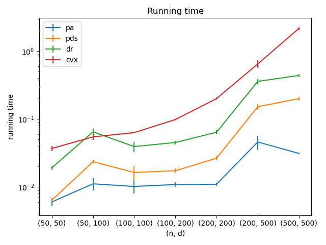
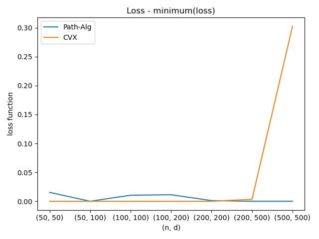
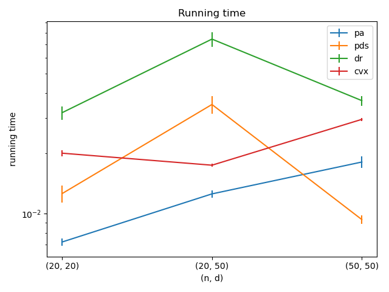
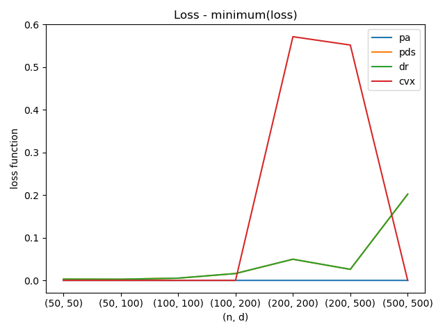
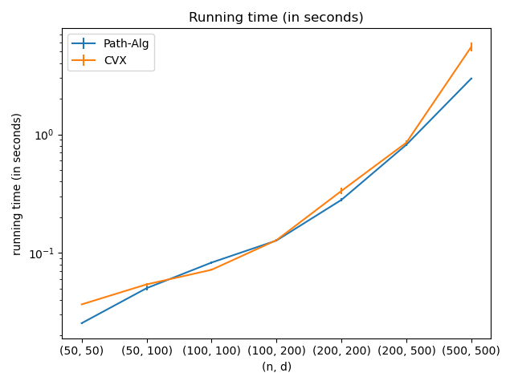

# Numerical benchmarks for c-lasso 

We provide numerical benchmarks for the [c-lasso package](https://c-lasso.readthedocs.io/en/latest/) in comparison to [cvxpy](https://www.cvxpy.org). 
We analyze run times, constraint satisfaction quality, and achieved minimum function values.

## Table of Contents

* [Benchmark setup](#installation)
* [Regression and classification problems](#regression-and-classification-problems)
* [Results](#getting-started)
* [Optimization schemes](#optimization-schemes)

* [References](#references)

##  Benchmark set-up

###  Tested Regression and classification problems

#### [R1] Standard constrained Lasso regression:             

This is the standard Lasso problem with linear equality constraints on the &beta; vector. 
The objective function combines Least-Squares for model fitting with l1 penalty for sparsity.   

#### [R2] Contrained sparse Huber regression:                   

This regression problem uses the [Huber loss](https://en.wikipedia.org/wiki/Huber_loss) as objective function 
for robust model fitting with l1 and linear equality constraints on the &beta; vector. The parameter &rho;=1.345.

#### [C1] Contrained sparse classification with Square Hinge loss (L1-Regularized Square-Hinge SVM): 

where the xi are the rows of X and l is defined as:

This formulation is similar to [R1] but adapted for classification tasks using the Square Hinge loss
with (constrained) sparse &beta; vector estimation.

## Results

#### R1

Run times for R1. 

Achieved minimum function values on R1. 

#### R2

Run times for R2. 

Achieved minimum function values on R2. 

#### C1

Run times for C1. 

Achieved minimum function values on C1. 

## Optimization schemes

We consider the following schemes in the benchmark.

### Path algorithms (Path-Alg, pa) 
This is the default algorithm for non-concomitant problems [R1,R3,C1,C2]. 
The algorithm uses the fact that the solution path along &lambda; is piecewise-
affine (as shown, e.g., in [1]). When Least-Squares is used as objective function,
we derive a novel efficient procedure that allows us to also derive the 
solution for the concomitant problem [R2] along the path with little extra computational overhead.

### Projected primal-dual splitting method (P-PDS):
This algorithm is derived from [2] and belongs to the class of 
proximal splitting algorithms. It extends the classical Forward-Backward (FB) 
(aka proximal gradient descent) algorithm to handle an additional linear equality constraint
via projection. In the absence of a linear constraint, the method reduces to FB.
This method can solve problem [R1]. 

### Douglas-Rachford-type splitting method (dr)
This algorithm is the most general algorithm and can solve all regression problems 
[R1-R4]. It is based on Doulgas Rachford splitting in a higher-dimensional product space.
It makes use of the proximity operators of the perspective of the LS objective (see [4,5])

### CVX (Conic operator splitting,cvx)
For external comparison, we use cvx and its underlying conic solver (scs). For more info, see [6].

## References 

* [1] B. R. Gaines, J. Kim, and H. Zhou, [Algorithms for Fitting the Constrained Lasso](https://www.tandfonline.com/doi/abs/10.1080/10618600.2018.1473777?journalCode=ucgs20), J. Comput. Graph. Stat., vol. 27, no. 4, pp. 861–871, 2018.

* [2] L. Briceno-Arias and S.L. Rivera, [A Projected Primal–Dual Method for Solving Constrained Monotone Inclusions](https://link.springer.com/article/10.1007/s10957-018-1430-2?shared-article-renderer), J. Optim. Theory Appl., vol. 180, Issue 3, March 2019.

* [3] S. Rosset and J. Zhu, [Piecewise linear regularized solution paths](https://projecteuclid.org/euclid.aos/1185303996), Ann. Stat., vol. 35, no. 3, pp. 1012–1030, 2007.

* [4] P. L. Combettes and C. L. Müller, [Perspective M-estimation via proximal decomposition](https://arxiv.org/abs/1805.06098), Electronic Journal of Statistics, 2020, [Journal version](https://projecteuclid.org/euclid.ejs/1578452535) 

* [5] P. L. Combettes and C. L. Müller, [Regression models for compositional data: General log-contrast formulations, proximal optimization, and microbiome data applications](https://arxiv.org/abs/1903.01050), Statistics in Bioscience, 2020.

* [6] B. O’Donoghue, E. Chu, N. Parikh, and S. Boyd. [Conic optimization via operator splitting and homogeneous self-dual embedding.](https://link.springer.com/article/10.1007/s10957-016-0892-3), Journal of Optimization Theory and Applications 169, no. 3 (2016): 1042-1068.

