Getting started
======================

Installation
^^^^^^^^^^^^^^^^

c-lasso is available on pip. You can install the package
in the shell using

.. code-block::

     pip install c-lasso

To use the c-lasso package in Python, type 

.. code-block:: python

     from classo import classo_problem 
     # one can add auxiliary functions as well such as random_data or csv_to_np

The `c-lasso` package depends on the following Python packages:

- ``numpy``; 
- ``matplotlib``; 
- ``scipy``; 
- ``pandas``; 
- ``h5py``
- ``pytest`` (for tests)

Examples on synthetic data
^^^^^^^^^^^^^^^^^^^^^^^^^^^^

Basic example
""""""""""""""""

We begin with a basic example that shows how to run c-lasso on synthetic data. This example and the next one can be found on the notebook 'Synthetic data Notebook.ipynb'

The c-lasso package includes
the routine ``random_data`` that allows you to generate problem instances using normally distributed data.

.. code-block:: python

     m, d, d_nonzero, k, sigma = 100, 200, 5, 1, 0.5
     (X, C, y), sol = random_data(m, d, d_nonzero, k, sigma, zerosum=True, seed=1)

This code snippet generates a problem instance with sparse :math:`\beta` in dimension
d=100 (sparsity d_nonzero=5). The design matrix X comprises n=100 samples generated from an i.i.d standard normal
distribution. The dimension of the constraint matrix C is d x k matrix. The noise level is :math:`\sigma=0.5`. 
The input ``zerosum=True`` implies that C is the all-ones vector and :math:`C\beta=0`. The n-dimensional outcome vector y
and the regression vector :math:`\beta` is then generated to satisfy the given constraints. 

Next we can define a default c-lasso problem instance with the generated data:

.. code-block:: python

     problem = classo_problem(X, y, C) 

You can look at the generated problem instance by typing:

.. code-block:: python

     print(problem)

This gives you a summary of the form:

.. code-block::

     FORMULATION: R3
     
     MODEL SELECTION COMPUTED:  
          Stability selection
     
     STABILITY SELECTION PARAMETERS: 
          numerical_method : not specified
          method : first
          B = 50
          q = 10
          percent_nS = 0.5
          threshold = 0.7
          lamin = 0.01
          Nlam = 50

As we have not specified any problem, algorithm, or model selection settings, this problem instance
represents the *default* settings for a c-lasso instance: 
- The problem is of regression type and uses formulation [R3], i.e. with concomitant scale estimation. 
- The *default* optimization scheme is the path algorithm (see [Optimization schemes](#optimization-schemes) for further info). 
- For model selection, stability selection at a theoretically derived :math:`\beta` value is used (see [Reference](#references) [4] for details). Stability selection comprises a relatively large number of parameters. For a description of the settings, we refer to the more advanced examples below and the API.

You can solve the corresponding c-lasso problem instance using

.. code-block:: python

     problem.solve()

After completion, the results of the optimization and model selection routines 
can be visualized using

.. code-block:: python

     print(problem.solution)

The command shows the running time(s) for the c-lasso problem instance, and the selected variables for sability selection

.. code-block::

     STABILITY SELECTION : 
   Selected variables :  7    63    148    164    168    
   Running time :  1.546s

Here, we only used stability selection as *default* model selection strategy. 
The command also allows you to inspect the computed stability profile for all variables 
at the theoretical :math:`\lambda`.

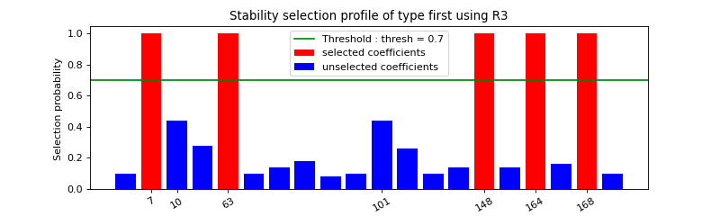

The refitted :math:`\beta` values on the selected support are also displayed in the next plot

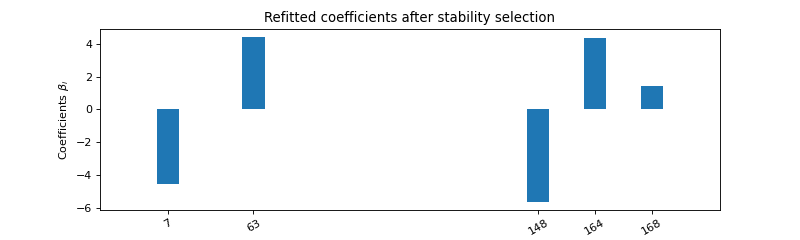

Advanced example  
^^^^^^^^^^^^^^^^^^           

In the next example, we show how one can specify different aspects of the problem 
formulation and model selection strategy.

.. code-block:: python

     m,  d,  d_nonzero,  k, sigma = 100, 200, 5, 0, 0.5
     (X, C, y), sol = random_data(m, d, d_nonzero, k, sigma, zerosum = True, seed = 4)
     problem                                     = classo_problem(X, y, C)
     problem.formulation.huber                   = True
     problem.formulation.concomitant             = False
     problem.model_selection.CV                  = True
     problem.model_selection.LAMfixed            = True
     problem.model_selection.PATH                = True
     problem.model_selection.StabSelparameters.method = 'max'
     problem.model_selection.CVparameters.seed = 1
     problem.model_selection.LAMfixedparameters.rescaled_lam = True
     problem.model_selection.LAMfixedparameters.lam = .1

     problem.solve()
     print(problem)

     print(problem.solution)

Results : 

.. code-block::

     FORMULATION: R2
     
     MODEL SELECTION COMPUTED:  
          Lambda fixed
          Path
          Cross Validation
          Stability selection
     
     LAMBDA FIXED PARAMETERS: 
          numerical_method = Path-Alg
          rescaled lam : True
          threshold = 0.09
          lam = 0.1
          theoretical_lam = 0.224
     
     PATH PARAMETERS: 
          numerical_method : Path-Alg
          lamin = 0.001
          Nlam = 80
     
     
     CROSS VALIDATION PARAMETERS: 
          numerical_method : Path-Alg
          one-SE method : True
          Nsubset = 5
          lamin = 0.001
          Nlam = 80
     
     
     STABILITY SELECTION PARAMETERS: 
          numerical_method : Path-Alg
          method : max
          B = 50
          q = 10
          percent_nS = 0.5
          threshold = 0.7
          lamin = 0.01
          Nlam = 50

     LAMBDA FIXED : 
     Selected variables :  17    59    123    
     Running time :  0.104s

     PATH COMPUTATION : 
     Running time :  0.638s

     CROSS VALIDATION : 
     Selected variables :  16    17    57    59    64    73    74    76    93    115    123    134    137    181    
     Running time :  2.1s

     STABILITY SELECTION : 
     Selected variables :  17    59    76    123    137    
     Running time :  6.062s

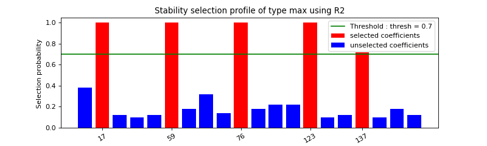

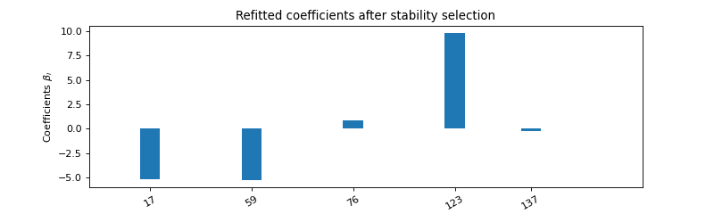

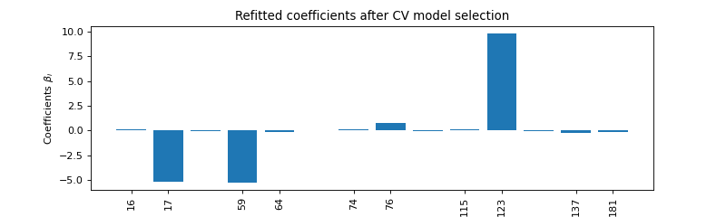

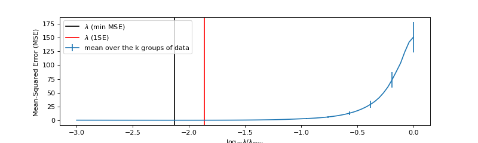

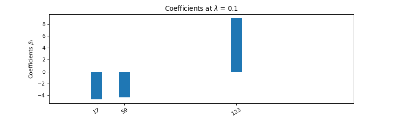

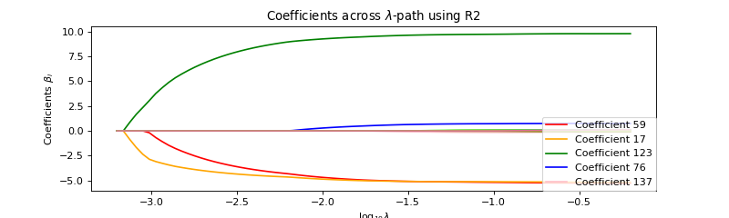

Log-contrast regression for microbiome data
^^^^^^^^^^^^^^^^^^^^^^^^^^^^^^^^^^^^^^^^^^^^^^^^^^^^

In the `the accompanying notebook <./examples/example-notebook.ipynb>`_ we study several microbiome data sets. We showcase two examples below.

BMI prediction using the COMBO dataset 
"""""""""""""""""""""""""""""""""""""""""""""

We first consider the [COMBO data set](./examples/COMBO_data) and show how to predict Body Mass Index (BMI) from microbial genus abundances and two non-compositional covariates  using "filtered_data".

.. code-block:: python

     from classo import csv_to_np, classo_problem, clr

     # Load microbiome and covariate data X
     X0  = csv_to_np('COMBO_data/complete_data/GeneraCounts.csv', begin = 0).astype(float)
     X_C = csv_to_np('COMBO_data/CaloriData.csv', begin = 0).astype(float)
     X_F = csv_to_np('COMBO_data/FatData.csv', begin = 0).astype(float)

     # Load BMI measurements y
     y   = csv_to_np('COMBO_data/BMI.csv', begin = 0).astype(float)[:, 0]
     labels = csv_to_np('COMBO_data/complete_data/GeneraPhylo.csv').astype(str)[:, -1]

     # Normalize/transform data
     y   = y - np.mean(y) #BMI data (n = 96)
     X_C = X_C - np.mean(X_C, axis = 0)  #Covariate data (Calorie)
     X_F = X_F - np.mean(X_F, axis = 0)  #Covariate data (Fat)
     X0 = clr(X0, 1 / 2).T

     # Set up design matrix and zero-sum constraints for 45 genera
     X     = np.concatenate((X0, X_C, X_F, np.ones((len(X0), 1))), axis = 1) # Joint microbiome and covariate data and offset
     label = np.concatenate([labels, np.array(['Calorie', 'Fat', 'Bias'])])
     C = np.ones((1, len(X[0])))
     C[0, -1], C[0, -2], C[0, -3] = 0., 0., 0.

     # Set up c-lassso problem
     problem = classo_problem(X, y, C, label = label)

     # Use stability selection with theoretical lambda [Combettes & Müller, 2020b]
     problem.model_selection.StabSelparameters.method      = 'lam'
     problem.model_selection.StabSelparameters.threshold_label = 0.5

     # Use formulation R3
     problem.formulation.concomitant = True

     problem.solve()
     print(problem)
     print(problem.solution)

     # Use formulation R4
     problem.formulation.huber = True
     problem.formulation.concomitant = True

     problem.solve()
     print(problem)
     print(problem.solution)

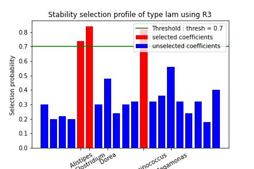

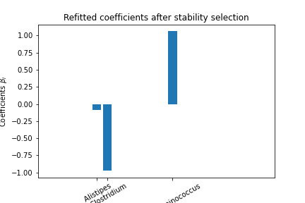

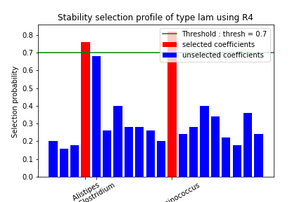

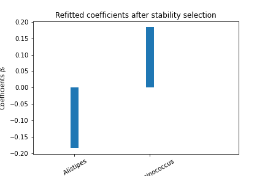

pH prediction using the Central Park soil dataset 
""""""""""""""""""""""""""""""""""""""""""""""""""""""""""""

The next microbiome example considers the `Central Park Soil dataset <../../examples/pH_data>`_ from `Ramirez et al. <https://royalsocietypublishing.org/doi/full/10.1098/rspb.2014.1988>`_. The sample locations are shown in the Figure on the right.
The task is to predict pH concentration in the soil from microbial abundance data. This task was also considered in `Tree-Aggregated Predictive Modeling of Microbiome Data <https://www.biorxiv.org/content/10.1101/2020.09.01.277632v1>`_.

Code to run this application is available in `the accompanying notebook <./examples/example-notebook.ipynb>`_ under `pH data <../../examples/pH_data>`_ Below is a summary of a c-lasso problem instance (using the R3 formulation).
 
.. code-block::

     FORMULATION: R3
     
     MODEL SELECTION COMPUTED:  
          Lambda fixed
          Path
          Stability selection
     
     LAMBDA FIXED PARAMETERS: 
          numerical_method = Path-Alg
          rescaled lam : True
          threshold = 0.008
          lam : theoretical
          theoretical_lam = 0.2182
     
     PATH PARAMETERS: 
          numerical_method : Path-Alg
          lamin = 0.001
          Nlam = 80
     
     
     STABILITY SELECTION PARAMETERS: 
          numerical_method : Path-Alg
          method : lam
          B = 50
          q = 10
          percent_nS = 0.5
          threshold = 0.7
          lam = theoretical
          theoretical_lam = 0.3085

The c-lasso estimation results are summarized below:

.. code-block::

     LAMBDA FIXED : 
     Sigma  =  0.633
     Selected variables :  15    18    19    23    25    27    43    47    50    53    57    58    62    89    93    94    104    107    
     Running time :  0.031s

     PATH COMPUTATION : 
     Running time :  0.174s

     STABILITY SELECTION : 
     Selected variables :  18    19    43    62    94    107    
     Running time :  0.826s

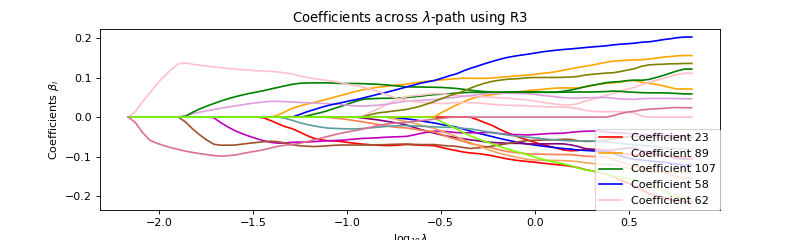

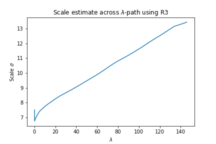

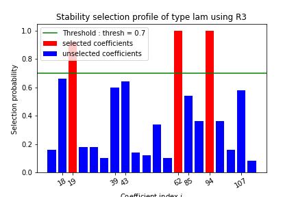

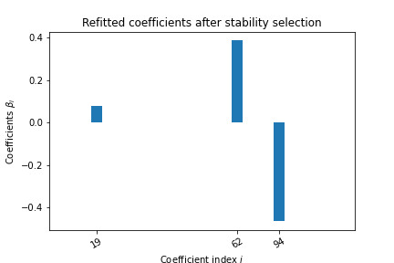

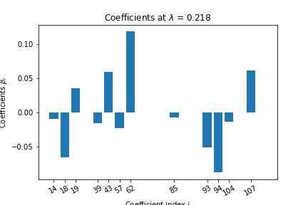

