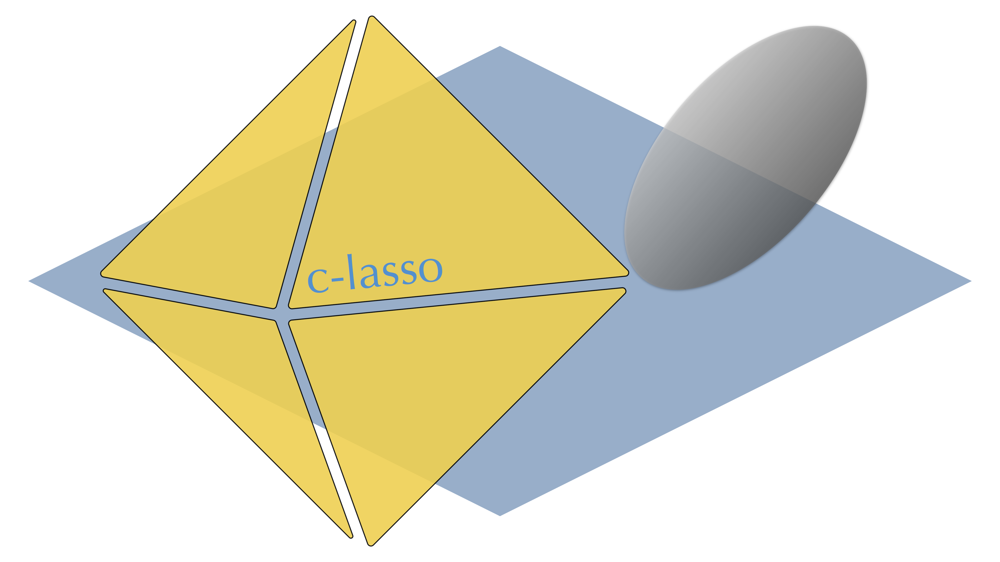

.. classo documentation master file, created by
   sphinx-quickstart on Wed Oct 21 00:43:44 2020.
   You can adapt this file completely to your liking, but it should at least
   contain the root `toctree` directive.

Welcome to classo's documentation!
==================================

c-lasso is a Python package that enables sparse and robust linear regression and classification with linear equality constraints on the model parameters. 

The package is available on `https://github.com/Leo-Simpson/c-lasso`.

.. toctree::
   :maxdepth: 2
   :caption: Contents:

   description
   getting-started
   problem_classo
   misc-functions
   structure-code

   additional/license
   ../../CONTRIBUTING.rst

Indices and tables
==================

* :ref:`genindex`
* :ref:`modindex`
* :ref:`search`
